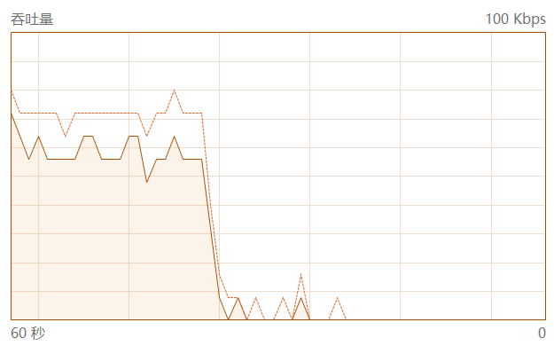
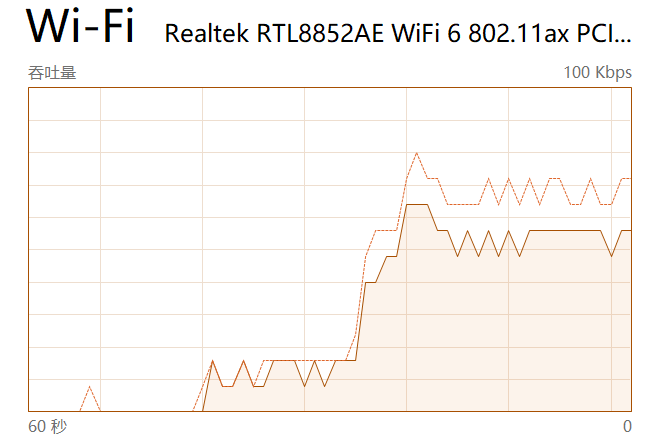

# 解析SQL语句

**要么先写一个垃圾传上去看看效果，不管是否慢**

**可以**


解析的内容全部参考官方文档[mysqlType](https://dev.mysql.com/doc/refman/8.0/en/numeric-types.html)

解析的内容就先这样不管了，等完成多线程插入再看看如何修改

### DECIMAL

1. **DECIMAL 如果总长度小于等于M，但是小数点的位数超过了N会导致超过精度后的数字被删除！这不会影响插入的结果**

   ```mysql
   create table `a`(
   	id char (32) NOT NULL DEFAULT "9999" primary key,
   	par1 INTEGER default 10,
   	par2 DECIMAL(10, 5) default 10.9
   );
   
   INSERT into a values ('18', 1, 12345.11111111111111111);
   -- 数据库中的结果 12345.11111
   ```

2. 如果未设定N，会导致只有整数位，没有小数位

   ```mysql
   create table `a`(
   	id char (32) NOT NULL DEFAULT "9999" primary key,
   	par1 INTEGER default 10,
   	par2 DECIMAL default 10.9
   );
   
   INSERT into a values ('18', 1, 12345.11111111111111111);
   -- 数据库中的结果 12345
   ```

### FLOAT

in the mysql, the float data only save 6 point, such as the
10.511242023999337   -> 10.5112
10.511252023999337   -> 10.5113
100.51124202399933   -> 100.511
1234567890           -> 1234570000
0.123456789          -> 0.123457
float的精度 是一个很大的问题

if you want to select from the database by the condition of (id , 1234567890) (suppose you have inserted the row with the id and the 12...)
you will not able to select for (id ,1234567890) 

[MYSQL FLOAT](https://dev.mysql.com/doc/internals/en/floating-point-types.html)

### double
0.123456789123456789 -> 
0.12345678912345678

10.511242023999337 ->
10.511242023999335

576.0974001178995 ->
576.0974001178995

12.5485555048078199 ->
12.54855550480782

double 不会进位么？ double wuold in some specific situation
double 也存在进位问题，但是实质上虽然存在进位情况，也能正确查询出来


    float单精度小数部分只能精确到后面6位，加上小数点前的一位，即有效数字为7位

    double双精度小数部分能精确到小数点后的15位，加上小数点前的一位 有效位数为16位。

    最后就区别出了小数点后边位数的长度，越长越精确!

double 和 float 彼此的区别:

    在内存中占有的字节数不同, 单精度内存占4个字节,  双精度内存占8个字节

    有效数字位数不同(尾数)  单精度小数点后有效位数7位,  双精度小数点后有效位数16位

    数值取值范围不同  根据IEEE标准来计算!

    在程序中处理速度不同,一般来说，CPU处理单精度浮点数的速度比处理双精度浮点数快


### STRING类型

1. char char如果后面不设置长度，即长度为1

   ```mysql
   create table `a`(
   	id char NOT NULL DEFAULT "" primary key
   );
   INSERT into a values ('1');
   
   CHAR,       // 0-255 bytes 		如果不设置长度值，长度为1
   VARCHAR,    // 0-65535 bytes 	如果不设置长度值，直接报错，不能不设置长度值
   -- 下面的是不能设置字段长度 否则会报错
   TINYBLOB,   // 0-255 bytes 		如果不设置长度值，不超过 255 个字符的二进制字符串
   TINYTEXT,   // 0-255 bytes 		如果不设置长度值，不超过 255 个字符的二进制字符串
   -- 下面能设置字段长度
   BLOB,       // 0-65 535 bytes 二进制形式的长文本数据
   TEXT,       // 0-65 535 bytes 长文本数据
   -- 下面的是不能设置字段长度 否则会报错
   MEDIUMBLOB, // 0-16 777 215 bytes 二进制形式的中等长度文本数据
   MEDIUMTEXT, // 0-16 777 215 bytes 中等长度文本数据
   LONGBLOB,   // 0-4 294 967 295 bytes二进制形式的极大文本数据
   LONGTEXT;   // 0-4 294 967 295 bytes 极大文本数据
   ```

能设置长度的只有char varchar blob text，其中如果要使用必须要设置长度值的是char（不设置长度为1） 和varchar

当我们对text设置长度值的时候，并且长度值小于等于63，会自动退化到tinytext，当设置的值大于等于64的时候，关于这列的text长度定义会自动删除.

**！！可能存在问题** 我们只对char类型和varchar类型进行长度比较，其他直接按照

#### BLOB & TEXT

区别：BLOB值被视为二进制字符串（字节字符串）。他们没有字符集，排序和比较基于列值中字节的数值。TEXT值被视为非二进制字符串（字符串）。他们有一个字符集，并且根据字符集的排序规则对值进行排序和比较。

BLOB, TEXT, GEOMETRY or JSON column 'id' can't have a default value。

这玩意不能有初始值。

# 插入数据

## 对于无主键表格

~~无主键可通过创建视图来加速，最后只要删除视图就行了，不会影响到数据~~

~~视图并不能创建索引，所以还是不行~~ 

先创建个主键，然后丢弃这个主键就行了（不知道能不能执行），但是基本语句是不会变的，肯定是先要查询

## 对于查询操作

1. 单主键肯定是可以这样的，来提高效率

   ```mysql
   select firstName, lastName FROM users WHERE userId in (?, ?, ?, ?, ?)
   ```

   但是多主键要怎么处理呢？只能一条条查询么？

策略：

​	单主键 类似上面联合查询

​	多主键，每条查询一次

```mysql
IF EXISTS (SELECT * FROM Products WHERE id = ?)
BEGIN
--do what you need if exists
END
ELSE
BEGIN
--do what needs to be done if not
END
```

一句话完成插入的任务，现在有两个问题

1. 如何完成对时间的判断
2. 官方数据库是否支持这种操作？

## 对插入过程的分析

1. 39MB的数据有 50W行，数据行数很大，所以要攒到足够多的行才插入

   对于一个表 的一个表文件 如果10w一次性插入 耗时20s，如果1w行插入耗时39秒 主键里面只有一列

   主键如果有两列的话：55s左右
   
2. 插入过程中如果存在重复主键的话，会直接报错，程序直接推出运行

3. 疑问：将数据全部设置为string类型会损失精度么？MYSQL float的精度为多少？在mysql中float使用了精度和默认float是一样的，最多存储6个数字。那应该是mysql的精度不够导致的

## 插入数据过程

需要注意的是，多个源端的数据中的表和数据可能存在冲突，对于同表的数据有冲突的情况（注：每个表都有类型为datetime的updated_at字段）： 

- 如果有主键或者非空唯一索引，唯一索引相同的情况下，以行updated_at时间戳来判断是否覆盖数据，如果updated_at比原来的数据更新，那么覆盖数据；否则忽略数据。不存在主键相同，updated_at时间戳相同，但数据不同的情况。
- 如果没有主键或者非空唯一索引，如果除updated_at其他数据都一样，只更新updated_at字段；否则，插入一条新的数据。
注：每个表都有类型为datetime的updated_at字段

1. 构建parparedStatement，利用parparedstatement来实现查询数据和插入数据两个操作

2. 由于数据太大，在本地判断数据出没出现过很难控制使用内存大小的（4核心，8GB内存），很容易爆掉内存，因此肯定不能再本地去判断数据是否重复，只能通过数据库来知道数据是否存在重复的情况

3. **这个项目对于数据库的操作只有插入和更新两种操作，对数据插入的流程如下：**
   1. 有主键或者有非空唯一索引的
      1. 主键或者非空唯一索引去查询数据库更新时间
         1. 如果数据库中存在以该主键或者非空唯一索引的列
            1. update_at更新，更新整个列
            2. 否则不做任何操作
         2. 如果数据库中不存在以该主键或者非空唯一索引的列
            1. 将该行数据插入
      
   2. 如果没有主键或者非空唯一索引的
   
      要先对这个数据建立视图（官方给了我们建立视图的权限，然后对视图建立索引）
   
      1. 以该行的除了update_at的其他数据去查询数据库，如果存在
         1. 更新update_at
      2. 如果不存在
         1. 将改行数据插入数据库

**流程需要改动，由于batch select不会放回结果值，只会放回成功或者没成功，不会有相关的数据传入**

If what you're after is performance, then executing 5 queries to find 5 users given an array of 5 IDs is not really the best solution. You'd better execute a single query that loads all the users at once, using

```ruby
select firstName, lastName FROM users WHERE userId in (?, ?, ?, ?, ?)
```

Similarly, your `getAllUsers()` method is extremely inefficient. It should execute a single query, instead of executing a query to get all the IDs, and then a query for every ID found.

单次查询但是是查询我需要的结果，但是单次查询包含了很多列

1. 有主键或者有非空唯一索引的
   1. 主键或者非空唯一索引去查询数据库更新时间
      1. 如果数据库中存在以该主键或者非空唯一索引的列
         1. update_at更新，更新整个列
         2. 否则不做任何操作
      2. 如果数据库中不存在以该主键或者非空唯一索引的列
         1. 将该行数据插入
2. 如果没有主键或者非空唯一索引的
   1. 以该行的除了update_at的其他数据去查询数据库，如果存在
      1. 更新update_at
   2. 如果不存在
      1. 将改行数据插入数据库

1. 由于机器在和远端机器通信的过程中肯定会有延迟的，如果一条一条查询，效率肯定不高，故利用**batch insert**。但是batch insert效率还没有达到最高。

   ```java
   // Disable auto-commit
   connection.setAutoCommit(false);
   
           // Create a prepared statement
           String sql = "INSERT INTO mytable (xxx), VALUES(?)";
           PreparedStatement pstmt = connection.prepareStatement(sql);
   
           Object[] vals=set.toArray();
           for (int i=0; i<vals.length; i++) {
   pstmt.setString(1, vals[i].toString());
   pstmt.addBatch();
   }
   
   // Execute the batch
   int [] updateCounts = pstmt.executeBatch();
   System.out.append("inserted "+updateCounts.length);
   ```

   可以利用参数设置，将batch发送的数据转换成命令列表和参数，减少发送数据包的体积

   [参考链接1](https://stackoverflow.com/questions/2993251/jdbc-batch-insert-performance)

   I had a similar performance issue with mysql and solved it by setting the *useServerPrepStmts* and the *rewriteBatchedStatements* properties in the connection url.

   ```java
   Connection c = DriverManager.getConnection("jdbc:mysql://host:3306/db?useServerPrepStmts=false&rewriteBatchedStatements=true", "username", "password");
   ```

   `rewriteBatchedStatements=true` is the important parameter. `useServerPrepStmts` is already false by default, and even changing it to true doesn't make much difference in terms of batch insert performance.

   Now I think is the time to write how `rewriteBatchedStatements=true` improves the performance so dramatically. It does so by `rewriting of prepared statements for INSERT into multi-value inserts when executeBatch()` ([Source](http://dev.mysql.com/doc/connector-j/en/connector-j-reference-configuration-properties.html)). That means that instead of sending the following `n` INSERT statements to the mysql server each time `executeBatch()` is called :

   ```mysql
   INSERT INTO X VALUES (A1,B1,C1)
   INSERT INTO X VALUES (A2,B2,C2)
   ...
   INSERT INTO X VALUES (An,Bn,Cn)
   ```

   将这种格式的改成

   ```mysql
   INSERT INTO X VALUES (A1,B1,C1),(A2,B2,C2),...,(An,Bn,Cn)
   ```

insert

```mysql
INSERT INTO table_name
VALUES (value1,value2,value3,...);

INSERT INTO table_name (column1,column2,column3,...)
VALUES (value1,value2,value3,...);
```

delete

```mysql
DELETE FROM table_name
WHERE some_column=some_value;
```

update

```mysql
UPDATE table_name
SET column1=value1,column2=value2,...
WHERE some_column=some_value;
```

select

```mysql
SELECT column_name,column_name
FROM table_name
WHERE column_name operator value;
```


[批处理插入参考链接](https://blog.csdn.net/cunchi4221/article/details/107471675)

[MYSQL的数据类型和JAVA之间的联系和区别](https://blog.csdn.net/u013991521/article/details/80834875)


## 编写插入时候遇到的错误

1. 如果要batch插入，最后结尾不能带有分割符’;‘，否则会报错

2. 当主键为(bigint, float) 的时候会出现，即使这一行已经在数据库中了，但是利用原数据作为where的语句还是无法查询到结果的问题，导致插入出现duplicate primary key 的问题


## 编写程序的时候 项目里面的坑

1. 同一个表内都存在重复数据


## 优化方式

1. Disable auto-commit mode

2. [10 Best Parctices](https://javarevisited.blogspot.com/2012/08/top-10-jdbc-best-practices-for-java.html#axzz7HfcSIUMv)

3. **Always close Statement, PreparedStatement, and Connection.**

4. [MySQL中float、double、decimal三个浮点类型的区别与总结](https://bbs.huaweicloud.com/forum/thread-90199-1-1.html)

5. 初步构想，为了完全利用服务器资源： 当一个线程中的update cnt 第一次达到10000的时候，使用信号量，让主线程再启动一个插入子线程
   


## 问题

1. 

   程序还在跑但是，不发送数据，说明没有饱和，我的查询和发送没有饱和

   

2. 
   

1. 还有一个问题，就是连接直接失效，无法连接上数据库，不知道为什么。
   好像tdsql 外网连接有点问题。。。。
2. 一些mysql性能优化的stackoverflow的链接
   https://stackoverflow.com/questions/25850569/improve-jdbc-performance
   https://stackoverflow.com/questions/31471984/how-to-improve-the-select-query-performance-in-java-is-there-a-way-to-do-selec
   https://stackoverflow.com/questions/50089761/how-to-improve-performance-of-jdbc-query-execution
   https://stackoverflow.com/questions/24171653/mysql-select-performance-issue-with-jdbc
   https://stackoverflow.com/questions/2993251/jdbc-batch-insert-performance
   https://stackoverflow.com/questions/23120584/why-does-mysql-round-floats-way-more-than-expected